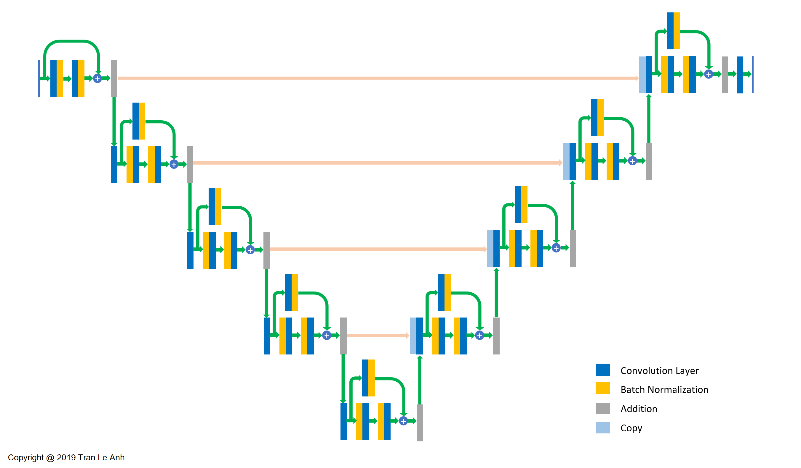

# Building Extraction with Enhanced ResUnet
Urban building extraction in Daejeon region using Modified Residual U-Net (Modified ResUnet) and applying post-processing.

Data Sample:

## Unet:

## Enhanced ResUnet:

Sept. 2019

Tran Le Anh
